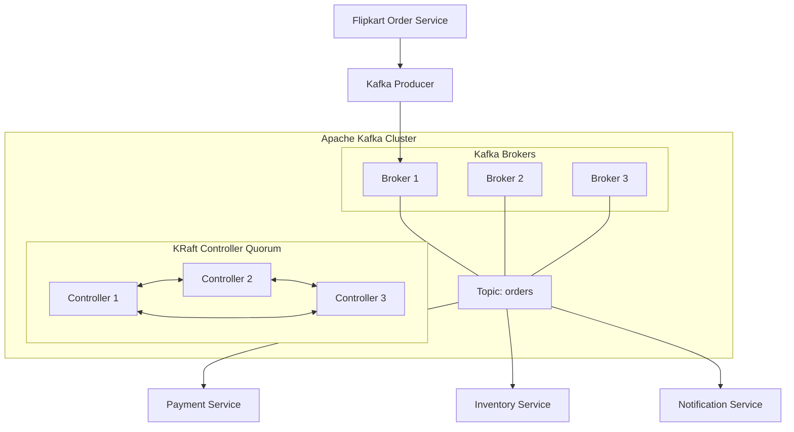
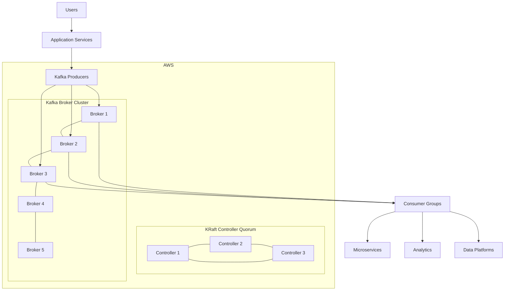

# 🚀 Apache Kafka — Zero to Production Kafka Administrator

<p align="center">


</p>

<p align="center">


</p>

---

# 🧭 KAFKA LEARNING LAB

> **A complete hands-on journey from Kafka fundamentals to production-grade Kafka administration, KRaft, security, monitoring, troubleshooting, AWS and enterprise architecture.**

---

## 🎯 Mission

This repository is designed to answer:

> **What is Kafka? Why do companies use it? How does it work internally? How do I deploy it? How do I administer it? How do I troubleshoot it? And how do I design Kafka for production?**

The learning path moves from:

```text
DATA
  ↓
EVENT
  ↓
MESSAGE
  ↓
MESSAGING
  ↓
QUEUE
  ↓
PUB/SUB
  ↓
EVENT-DRIVEN ARCHITECTURE
  ↓
DATA STREAMING
  ↓
EVENT STREAMING
  ↓
APACHE KAFKA
  ↓
PRODUCER
  ↓
TOPIC
  ↓
PARTITION
  ↓
BROKER
  ↓
CONSUMER
  ↓
CONSUMER GROUP
  ↓
REPLICATION
  ↓
ISR
  ↓
LEADER
  ↓
KRaft
  ↓
SECURITY
  ↓
MONITORING
  ↓
TROUBLESHOOTING
  ↓
PRODUCTION ARCHITECTURE
```

---

# 🧠 What is Apache Kafka?

Apache Kafka is a distributed event streaming platform.

In simple terms:

> **Applications produce events → Kafka stores and distributes those events → applications consume and process them.**

Example:

```text
                         FLIPKART
                            │
                            ▼
                     Order Service
                            │
                            │ OrderCreated
                            ▼
                       Kafka Producer
                            │
                            ▼
                 ┌──────────────────────┐
                 │    KAFKA CLUSTER     │
                 │                      │
                 │ Topic: orders        │
                 │                      │
                 │ P0  P1  P2           │
                 └──────────┬───────────┘
                            │
          ┌─────────────────┼─────────────────┐
          ▼                 ▼                 ▼
       Payment           Inventory        Notification
       Service            Service           Service
```

---

# 🏗️ Modern Kafka Architecture

Kafka 4.x uses **KRaft** rather than ZooKeeper.



---

# ⭐ The Most Important Mental Model

```text
┌──────────────────────────────────────────┐
│                  KAFKA                   │
├──────────────────────────────────────────┤
│                                          │
│ Topic                                     │
│   ↓                                      │
│ Partitions                                │
│   ↓                                      │
│ Brokers                                   │
│   ↓                                      │
│ Replicas                                  │
│   ↓                                      │
│ ISR                                       │
│   ↓                                      │
│ Leader                                    │
│                                          │
└──────────────────────────────────────────┘
```

---

# 🧩 Kafka Terminology Map

| Term               | Simple Meaning                  | Technical Meaning                                        |
| ------------------ | ------------------------------- | -------------------------------------------------------- |
| Kafka              | Event platform                  | Distributed event streaming platform                     |
| Cluster            | Group of servers                | Collection of Kafka nodes                                |
| Broker             | Kafka server                    | Stores/serves partition replicas                         |
| Topic              | Named channel                   | Logical stream of records                                |
| Partition          | Section of topic                | Ordered append-only log                                  |
| Record             | Message/event                   | Key/value/timestamp/headers                              |
| Producer           | Sender                          | Kafka client publishing records                          |
| Consumer           | Receiver                        | Kafka client reading records                             |
| Consumer Group     | Team of consumers               | Cooperative partition consumption group                  |
| Offset             | Message position                | Sequential position in partition                         |
| Leader             | Main partition replica          | Replica serving authoritative partition operations       |
| Follower           | Copy                            | Non-leader replica                                       |
| Replica            | Copy                            | Partition copy on broker                                 |
| ISR                | Healthy replicas                | In-Sync Replica set                                      |
| Replication Factor | Number of copies                | Number of partition replicas                             |
| Consumer Lag       | Unprocessed distance            | Difference between latest position and consumer position |
| Rebalance          | Work redistribution             | Consumer partition reassignment                          |
| KRaft              | Kafka coordination architecture | Kafka Raft metadata quorum                               |
| Controller         | Cluster coordinator             | KRaft metadata/controller node                           |

---

# 🟢 KRaft vs 🟠 ZooKeeper

## Legacy

```text
             ZooKeeper Ensemble

        ┌──────┬──────┬──────┐
        │ ZK1  │ ZK2  │ ZK3  │
        └──────┴──────┴──────┘
                  │
                  ▼
        ┌────────────────────┐
        │   Kafka Cluster    │
        │ B1   B2   B3       │
        └────────────────────┘
```

## Modern

```text
          KRaft Controller Quorum

        ┌──────┬──────┬──────┐
        │ C1   │ C2   │ C3   │
        └──────┴──────┴──────┘
                  │
                  ▼
        ┌────────────────────┐
        │   Kafka Cluster    │
        │ B1   B2   B3       │
        └────────────────────┘
```

### Key difference

> **ZooKeeper = external coordination system**

> **KRaft = Kafka-native metadata/coordination using Raft**

---

# 🥇 Recommended Learning Strategy

## Modern Kafka

```text
Kafka 4.x
   │
   ▼
KRaft
   │
   ▼
Broker
   │
   ▼
Topic
   │
   ▼
Partition
   │
   ▼
Producer
   │
   ▼
Consumer
   │
   ▼
Consumer Group
   │
   ▼
Replication
   │
   ▼
ISR
   │
   ▼
Leader Election
   │
   ▼
Administration
```

## Legacy Kafka

Learn ZooKeeper mainly for:

* Existing enterprise clusters
* Architecture understanding
* Troubleshooting
* Migration knowledge

---

# 📚 COMPLETE LEARNING ROADMAP

## 🟢 LEVEL 01 — Messaging Fundamentals

* [ ] Data
* [ ] Event
* [ ] Message
* [ ] Messaging
* [ ] Queue
* [ ] Pub/Sub
* [ ] Event-driven architecture
* [ ] Data streaming
* [ ] Event streaming

📁 `01-foundations/`

---

## 🔵 LEVEL 02 — Kafka Fundamentals

* [ ] What is Kafka?
* [ ] Kafka architecture
* [ ] Kafka cluster
* [ ] Broker
* [ ] Topic
* [ ] Record
* [ ] Key
* [ ] Value
* [ ] Headers
* [ ] Partition
* [ ] Offset

📁 `02-kafka-fundamentals/`

---

## 🟣 LEVEL 03 — Producers

* [ ] Producer architecture
* [ ] Producer configuration
* [ ] Bootstrap servers
* [ ] `acks`
* [ ] Batching
* [ ] Compression
* [ ] Retries
* [ ] Idempotence
* [ ] Producer errors
* [ ] Producer performance

📁 `03-producers/`

---

## 🟡 LEVEL 04 — Consumers

* [ ] Consumer
* [ ] Consumer group
* [ ] Group ID
* [ ] Consumer offset
* [ ] Offset commit
* [ ] `__consumer_offsets`
* [ ] Consumer lag
* [ ] Rebalance
* [ ] Partition assignment
* [ ] Consumer performance

📁 `04-consumers/`

---

## 🔥 LEVEL 05 — Kafka High Availability

* [ ] Leader
* [ ] Follower
* [ ] Replica
* [ ] Replication factor
* [ ] ISR
* [ ] URP
* [ ] Leader election
* [ ] Preferred replica
* [ ] Rack awareness
* [ ] `min.insync.replicas`
* [ ] Unclean leader election

📁 `05-high-availability/`

---

# 🟢 LEVEL 06 — KRaft

* [ ] What is KRaft?
* [ ] Raft
* [ ] Controller
* [ ] Controller quorum
* [ ] Active controller
* [ ] Controller election
* [ ] Metadata log
* [ ] Metadata snapshot
* [ ] Metadata quorum
* [ ] Epoch
* [ ] `node.id`
* [ ] `process.roles`
* [ ] Combined mode
* [ ] Dedicated controller
* [ ] Dynamic quorum

📁 `06-kraft/`

---

# 🟠 LEVEL 07 — ZooKeeper Legacy

* [ ] ZooKeeper
* [ ] ZooKeeper ensemble
* [ ] ZNode
* [ ] Ephemeral ZNode
* [ ] Persistent ZNode
* [ ] Sequential ZNode
* [ ] Watch
* [ ] Session
* [ ] Leader
* [ ] Follower
* [ ] Observer
* [ ] Quorum
* [ ] Zab
* [ ] ZXID
* [ ] Snapshot
* [ ] Transaction log
* [ ] `myid`
* [ ] `zoo.cfg`

📁 `07-zookeeper-legacy/`

---

# 🔐 LEVEL 08 — Kafka Security

* [ ] Authentication
* [ ] Authorization
* [ ] ACL
* [ ] Principal
* [ ] TLS
* [ ] SASL
* [ ] SCRAM
* [ ] Kerberos
* [ ] OAuth
* [ ] Encryption
* [ ] Certificate management
* [ ] Secret management

📁 `08-security/`

---

# 📊 LEVEL 09 — Monitoring

* [ ] JMX
* [ ] Broker metrics
* [ ] Producer metrics
* [ ] Consumer metrics
* [ ] Consumer lag
* [ ] ISR shrink
* [ ] ISR expand
* [ ] Under-replicated partitions
* [ ] Offline partitions
* [ ] Request latency
* [ ] Bytes in
* [ ] Bytes out
* [ ] CPU
* [ ] Memory
* [ ] Disk
* [ ] Network

📁 `09-monitoring/`

---

# 🚨 LEVEL 10 — Troubleshooting

### Scenario 1

```text
Producer cannot send message
```

Investigate:

```text
DNS
 ↓
Network
 ↓
Listener
 ↓
Advertised listener
 ↓
Authentication
 ↓
Authorization
 ↓
Topic
 ↓
Partition leader
```

### Scenario 2

```text
Consumer lag increasing
```

Investigate:

```text
Producer rate
       ↓
Consumer throughput
       ↓
Consumer CPU
       ↓
Consumer network
       ↓
Partition assignment
       ↓
Consumer group rebalance
```

### Scenario 3

```text
URP > 0
```

Investigate:

```text
Broker health
 ↓
Network
 ↓
Disk I/O
 ↓
Replication lag
 ↓
ISR
```

📁 `10-troubleshooting/`

---

# 🏗️ LEVEL 11 — Kafka Administration

* [ ] Topic creation
* [ ] Topic deletion
* [ ] Topic configuration
* [ ] Partition management
* [ ] Partition reassignment
* [ ] Replica reassignment
* [ ] Preferred leader election
* [ ] Broker maintenance
* [ ] Broker replacement
* [ ] Rolling restart
* [ ] Configuration management
* [ ] Quotas
* [ ] Throttling
* [ ] Capacity planning

📁 `11-administration/`

---

# 🌐 LEVEL 12 — AWS Kafka

```text
AWS
 │
 ├── EC2
 ├── VPC
 ├── Private Subnets
 ├── Security Groups
 ├── IAM
 ├── CloudWatch
 ├── EBS
 └── MSK
```

Labs:

* [ ] Kafka on EC2
* [ ] Private Kafka cluster
* [ ] Multi-AZ Kafka
* [ ] Security Groups
* [ ] EBS storage
* [ ] CloudWatch monitoring
* [ ] AWS MSK
* [ ] MSK security
* [ ] MSK networking

📁 `12-aws/`

---

# 🔄 LEVEL 13 — Kafka Connect

```text
Database
   │
   ▼
Source Connector
   │
   ▼
Kafka
   │
   ▼
Sink Connector
   │
   ▼
S3 / Elasticsearch / Database
```

Topics:

* [ ] Kafka Connect
* [ ] Worker
* [ ] Connector
* [ ] Source Connector
* [ ] Sink Connector
* [ ] Tasks
* [ ] Distributed mode
* [ ] REST API

📁 `13-kafka-connect/`

---

# 🌊 LEVEL 14 — Kafka Streams

* [ ] Stream processing
* [ ] KStream
* [ ] KTable
* [ ] State Store
* [ ] Windowing
* [ ] Event time
* [ ] Processing time
* [ ] Joins
* [ ] Aggregations

📁 `14-kafka-streams/`

---

# 📐 LEVEL 15 — Schema Management

* [ ] Schema
* [ ] Avro
* [ ] JSON Schema
* [ ] Protobuf
* [ ] Schema Registry
* [ ] Schema evolution
* [ ] Compatibility
* [ ] Backward compatibility
* [ ] Forward compatibility
* [ ] Full compatibility

📁 `15-schema-management/`

---

# 🌍 LEVEL 16 — Disaster Recovery

```text
Kafka Cluster A
      │
      │ MirrorMaker 2
      ▼
Kafka Cluster B
```

Topics:

* [ ] MirrorMaker 2
* [ ] Cross-cluster replication
* [ ] Active/Passive
* [ ] Active/Active
* [ ] RPO
* [ ] RTO
* [ ] DR testing

📁 `16-disaster-recovery/`

---

# 🧪 HANDS-ON LAB ROADMAP

## LAB 01 — Single Kafka Broker

```text
AWS EC2
   │
   ▼
Amazon Linux
   │
   ▼
Java
   │
   ▼
Kafka
   │
   ▼
KRaft
   │
   ▼
Broker + Controller
```

📁 `labs/01-single-broker-kraft/`

---

## LAB 02 — Producer & Consumer

```text
Producer
   │
   ▼
Topic
   │
   ▼
Partition
   │
   ▼
Consumer
```

📁 `labs/02-producer-consumer/`

---

## LAB 03 — Consumer Groups

```text
             Topic
          ┌────┼────┐
          ▼    ▼    ▼
         P0   P1   P2
          │    │    │
          ▼    ▼    ▼
         C1   C2   C3
```

📁 `labs/03-consumer-groups/`

---

## LAB 04 — Three Broker Cluster

```text
       KRaft Controllers

       C1    C2    C3
        │     │     │
        └─────┼─────┘
              │
     ┌────────┼────────┐
     ▼        ▼        ▼
    B1       B2       B3
```

📁 `labs/04-three-broker-cluster/`

---

## LAB 05 — Replication

```text
P0

B1 → Leader
B2 → Replica
B3 → Replica
```

Test:

```text
Stop B1
   ↓
Leader election
   ↓
B2 becomes leader
```

📁 `labs/05-replication/`

---

## LAB 06 — ISR

Test:

```text
ISR = [B1,B2,B3]
```

Stop/slow a broker.

Observe:

```text
ISR = [B1,B2]
```

📁 `labs/06-isr/`

---

## LAB 07 — Consumer Lag

Create:

```text
Producer rate > Consumer rate
```

Observe:

```text
Consumer Lag ↑
```

Then scale consumers.

Observe:

```text
Consumer Lag ↓
```

📁 `labs/07-consumer-lag/`

---

# 🧨 FAILURE ENGINEERING LABS

This repository is not only about making Kafka work.

We intentionally **break Kafka**.

### 🔥 Failure Tests

```text
[ ] Stop Broker
[ ] Kill Kafka process
[ ] Fill disk
[ ] Break listener
[ ] Break advertised listener
[ ] Stop consumer
[ ] Generate consumer lag
[ ] Cause ISR shrink
[ ] Cause partition reassignment
[ ] Test leader election
[ ] Test broker recovery
[ ] Test controller failure
```

📁 `labs/failure-engineering/`

---

# 🔧 Essential Kafka Commands

## Topics

```bash
kafka-topics.sh --list \
  --bootstrap-server localhost:9092
```

```bash
kafka-topics.sh --create \
  --topic orders \
  --bootstrap-server localhost:9092 \
  --partitions 3 \
  --replication-factor 1
```

```bash
kafka-topics.sh --describe \
  --topic orders \
  --bootstrap-server localhost:9092
```

---

## Producer

```bash
kafka-console-producer.sh \
  --topic orders \
  --bootstrap-server localhost:9092
```

---

## Consumer

```bash
kafka-console-consumer.sh \
  --topic orders \
  --bootstrap-server localhost:9092 \
  --from-beginning
```

---

# 🔍 Administration Command Map

```text
TOPICS
  │
  ├── kafka-topics.sh
  │
  └── kafka-configs.sh

PRODUCER
  │
  └── kafka-console-producer.sh

CONSUMER
  │
  └── kafka-console-consumer.sh

GROUPS
  │
  └── kafka-consumer-groups.sh

KRAFT
  │
  ├── kafka-storage.sh
  └── kafka-metadata-quorum.sh

PARTITIONS
  │
  └── kafka-reassign-partitions.sh
```

---

# 🧠 Kafka Administrator Mental Model

When something breaks, don't randomly run commands.

Think:

```text
                 PROBLEM
                    │
        ┌───────────┼───────────┐
        ▼           ▼           ▼
      CLIENT      BROKER     CONTROLLER
        │           │           │
        ▼           ▼           ▼
   Producer      Topic        KRaft
   Consumer      Partition    Metadata
   Network       Replica      Quorum
   Security      ISR          Election
```

Then investigate systematically.

---

# 📊 Production Architecture



---

# 🔐 Production Security Architecture

```text
                    Kafka Clients
                         │
                         ▼
                    TLS / SASL
                         │
                         ▼
                  Authentication
                         │
                         ▼
                   Authorization
                         │
                         ▼
                       ACL
                         │
                         ▼
                 Kafka Topic/Group
```

---

# 📈 Monitoring Architecture

```text
Kafka
  │
  ├── JMX
  │
  ▼
Prometheus
  │
  ▼
Grafana
  │
  ├── Broker Health
  ├── Consumer Lag
  ├── ISR
  ├── URP
  ├── Throughput
  ├── Latency
  └── Controller Health
```

---

# 🚨 Production Alert Checklist

| Alert                   | Meaning                          |
| ----------------------- | -------------------------------- |
| Consumer Lag ↑          | Consumers falling behind         |
| URP > 0                 | Replication problem              |
| Offline Partitions > 0  | Partition unavailable            |
| ISR Shrink              | Replica fell behind              |
| Disk usage ↑            | Storage capacity risk            |
| Network saturation      | Throughput bottleneck            |
| Request latency ↑       | Kafka/client performance problem |
| Controller quorum issue | Metadata availability risk       |

---

# 🏆 Kafka Administrator Skill Matrix

| Skill             | Beginner | Intermediate | Advanced |
| ----------------- | :------: | :----------: | :------: |
| Kafka Basics      |     ✅    |              |          |
| Topics            |     ✅    |              |          |
| Partitions        |     ✅    |              |          |
| Producers         |     ✅    |       ✅      |          |
| Consumers         |     ✅    |       ✅      |          |
| Consumer Groups   |          |       ✅      |          |
| Replication       |          |       ✅      |          |
| ISR               |          |       ✅      |          |
| KRaft             |          |       ✅      |     ⭐    |
| Security          |          |       ✅      |     ⭐    |
| Monitoring        |          |       ✅      |     ⭐    |
| Troubleshooting   |          |       ✅      |     ⭐    |
| Performance       |          |              |     ⭐    |
| Capacity Planning |          |              |     ⭐    |
| DR                |          |              |     ⭐    |
| AWS Kafka         |          |       ✅      |     ⭐    |
| Kafka Connect     |          |       ✅      |     ⭐    |
| Kafka Streams     |          |              |     ⭐    |

---

# 🎯 Final Goal

By completing this repository, you should be able to:

```text
                    YOU
                     │
                     ▼
             Kafka Fundamentals
                     │
                     ▼
              Kafka Developer
                     │
                     ▼
            Kafka Administrator
                     │
                     ▼
          Kafka Platform Engineer
                     │
                     ▼
       Senior Kafka / Streaming Engineer
```

---

# 📁 Repository Structure

```text
kafka-learning-lab/
│
├── README.md
│
├── 01-foundations/
│
├── 02-kafka-fundamentals/
│
├── 03-producers/
│
├── 04-consumers/
│
├── 05-high-availability/
│
├── 06-kraft/
│
├── 07-zookeeper-legacy/
│
├── 08-security/
│
├── 09-monitoring/
│
├── 10-troubleshooting/
│
├── 11-administration/
│
├── 12-aws/
│
├── 13-kafka-connect/
│
├── 14-kafka-streams/
│
├── 15-schema-management/
│
├── 16-disaster-recovery/
│
├── labs/
│   ├── 01-single-broker-kraft/
│   ├── 02-producer-consumer/
│   ├── 03-consumer-groups/
│   ├── 04-three-broker-cluster/
│   ├── 05-replication/
│   ├── 06-isr/
│   ├── 07-consumer-lag/
│   └── failure-engineering/
│
├── scripts/
│
├── configs/
│
├── diagrams/
│
└── interview-preparation/
```

---

# 📚 Official Documentation

* [Apache Kafka Documentation](https://kafka.apache.org/documentation/)
* [Kafka Quickstart](https://kafka.apache.org/quickstart/)
* [Kafka KRaft](https://kafka.apache.org/documentation/#kraft)
* [Kafka Operations](https://kafka.apache.org/documentation/#operations)
* [Kafka Security](https://kafka.apache.org/documentation/#security)
* [Kafka Connect](https://kafka.apache.org/documentation/#connect)
* [Kafka Streams](https://kafka.apache.org/documentation/streams/)

---

# 🧪 Learning Rule

> **Don't just read Kafka. Break Kafka. Fix Kafka. Observe Kafka.**

For every concept:

```text
LEARN
  ↓
CONFIGURE
  ↓
DEPLOY
  ↓
TEST
  ↓
BREAK
  ↓
OBSERVE
  ↓
TROUBLESHOOT
  ↓
DOCUMENT
```

---

# ⭐ Project Philosophy

```text
                 DON'T MEMORIZE
                       ↓
                 UNDERSTAND
                       ↓
                  BUILD IT
                       ↓
                  BREAK IT
                       ↓
                  FIX IT
                       ↓
                DOCUMENT IT
                       ↓
                MASTER KAFKA
```

---

# 🚀 Status

```text
Foundation              🟢
Kafka Fundamentals      🟢
KRaft                    🟢
ZooKeeper Legacy         🟡
Administration           🟡
Security                 🟡
Monitoring               🟡
Troubleshooting          🟡
AWS                      🟡
Enterprise Architecture  🟡
```

---

# 👨‍💻 Learning Lab

**Apache Kafka • KRaft • AWS • Linux • Platform Engineering**

> **From Zero → Kafka Administrator → Kafka Platform Engineer**

---

<p align="center">

### ⭐ Star this repository if it helps your Kafka journey.

### 🍴 Fork it. 🧪 Practice it. 🔥 Break it. 🚀 Master it.

</p>
